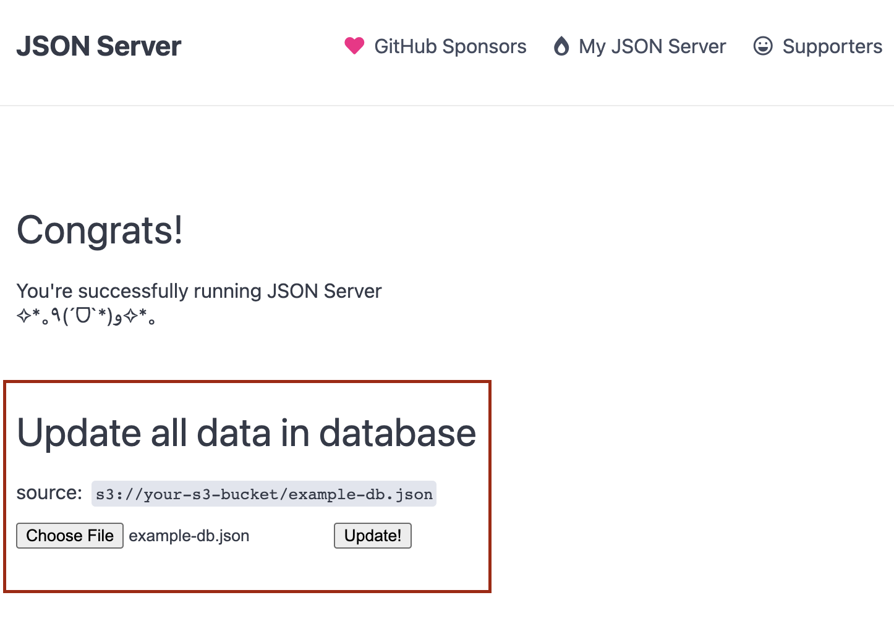

# JSON Server - AWS S3 support and other features

AWS S3 read and write support with lowDB S3 Adapter
```
$ export DB_SOURCE=s3://some-bucket/example-db.json
$ npm start
```

You can change the database source in runtime 

```
$ curl -H "Content-Type: application/json" -X PUT -d '{"source":"http://jsonplaceholder.typicode.com/db"}' http://localhost:5000/json-server/source

$ curl -H "Content-Type: application/json" -X PUT -d '{"source":"s3://some-bucket/example-db.json"}' http://localhost:5000/json-server/source
```

New index.html supports upload file to overwrite the entire database 



Reset the entire database with new data
```
$ curl -H "Content-Type: application/json" -X PUT --data-binary '@db.json' http://localhost:5000/db
```

- Endpoint to restart the server
```
$ curl -X POST localhost:5000/json-server/restart
```

## AWS Credentials
There are several ways in Node.js to supply your credentials to the SDK.

See https://docs.aws.amazon.com/sdk-for-javascript/v2/developer-guide/setting-credentials-node.html

For running this JSON Server as a Kubernetes Pod in AWS EKS it's highly recommended using **IAM roles for service accounts**. See https://docs.aws.amazon.com/eks/latest/userguide/iam-roles-for-service-accounts.html

## JSON Server as module 

```bash
$ npm install json-server --save-dev
```

https://github.com/typicode/json-server#module

## Docker

```bash
$ docker build . -t json-server-custom
$ docker run -p 6000:5000 -d -e DB_SOURCE='http://jsonplaceholder.typicode.com/db' --name json-server-custom json-server-custom
```